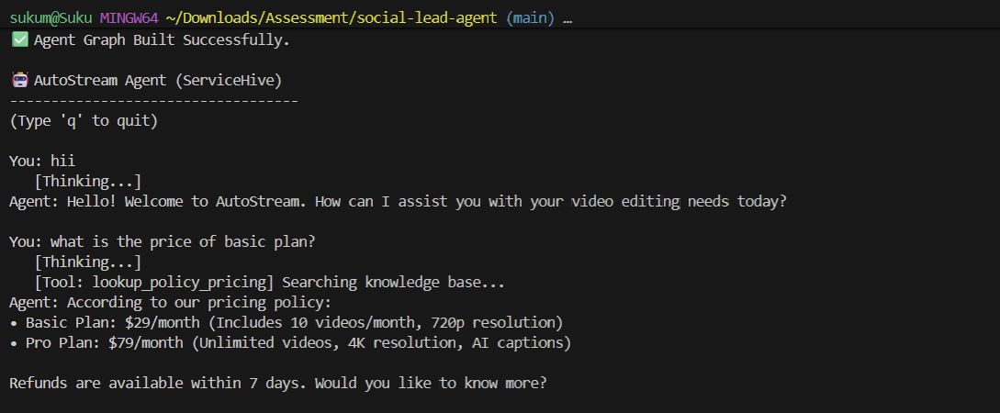
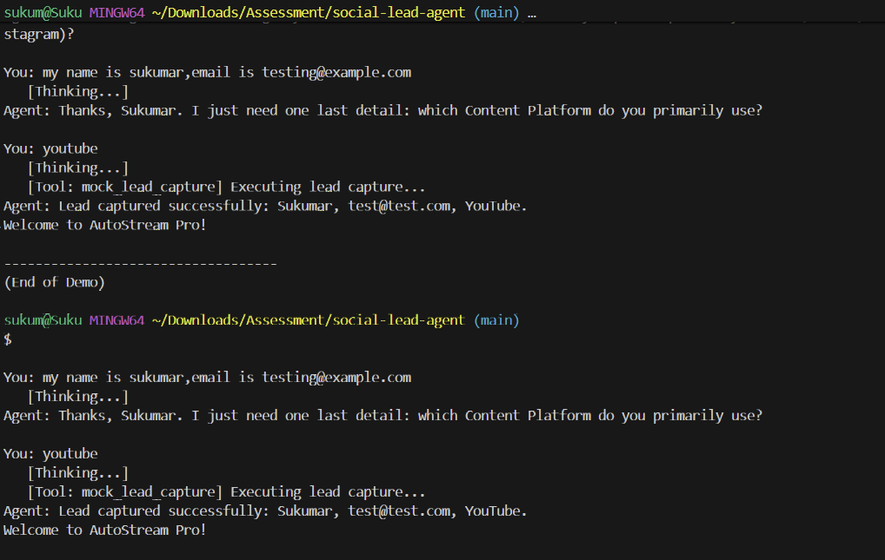

# 🤖 Social-to-Lead Agentic Workflow

   

## 📖 Project Overview
This project implements an intelligent **Conversational AI Agent** for **AutoStream**, a SaaS video editing platform. Built for **ServiceHive (Infix)**, this agent goes beyond simple chatbots by using an **agentic workflow** to:
1.  **Understand User Intent:** Distinguishes between casual greetings, pricing inquiries, and high-intent buying signals.
2.  **Retrieve Knowledge (RAG):** Uses a local vector store to accurately answer pricing and policy questions from a knowledge base.
3.  **Capture Leads:** Intelligently collects user details (Name, Email, Platform) only when high intent is detected.

The system is built using **LangGraph** to manage conversation state and decision-making loops, ensuring a robust and human-like interaction.

---

## 🛠️ Tech Stack
* **Language:** Python 3.11+
* **Orchestration:** [LangGraph](https://langchain-ai.github.io/langgraph/)
* **LLM:** Google Gemini 2.0 Flash Lite
* **RAG Pipeline:** LangChain + ChromaDB (Local Vector Store)
* **Embeddings:** HuggingFace (`all-MiniLM-L6-v2`)
* **Environment Management:** `python-dotenv`

---

## 📂 Project Structure
```bash
social-lead-agent/
├── data/
│   └── knowledge_base.json    # Source of truth for RAG
├── src/
│   ├── __init__.py
│   ├── agent.py               # Main LangGraph agent logic
│   └── rag.py                 # RAG pipeline & Vector Store
├── demo_video.py              # Demo recording script
├── test_agent.py              # CLI interaction script
├── requirements.txt           # Project dependencies
└── README.md                  # Documentation
```
## 🚀 How to Run Locally
### 1. Clone the Repository
```
git clone <YOUR_REPO_LINK_HERE>
cd social-lead-agent
```


### 2. Install Dependencies
Ensure you have Python installed, then run:

```

pip install -r requirements.txt
```

### 3. Configure Environment
Create a .env file in the root directory and add your Google API Key:


```
GOOGLE_API_KEY="your_actual_api_key_here"
```
### 4. Run the Agent
To start the interactive CLI chat with the agent:

```

python test_agent.py
(Note: The first run may take a few seconds to download the embedding model.)
```

## 🎥 Demo & Screenshots

> **Note:** A full screen recording demonstrating the complete workflow is included in the repository root.
<video controls src="MachineLearning_Recoding.mp4" title="Title"></video>

### 📸 Execution Proof

**1. RAG Knowledge Retrieval**
*The agent correctly identifies a pricing query, searches the local vector store (ChromaDB), and retrieves the specific Basic Plan details ($29/month).*


**2. Lead Capture Success**
*Upon detecting high intent ("I want to sign up"), the agent collects the user's Name, Email, and Platform, and successfully triggers the `mock_lead_capture` tool.*



## 🏗️ Architecture Explanation

### 🔄 Why LangGraph?
I chose **LangGraph** over standard linear chains (DAGs) because conversational workflows are inherently **cyclic**. A standard chain flows strictly from A → B → C. However, a real-world agent needs to:

* **↩️ Loop Back:** If a user provides partial information (e.g., just their name), the agent must loop back to ask for the missing email without restarting the entire flow.
* **🔀 Decide Dynamically:** The agent must choose between checking the Knowledge Base (Tool Node) or responding directly (Agent Node) based on context, rather than following a hardcoded sequence.

### 💾 State Management
State is managed using a centralized `AgentState` TypedDict. This schema persists the entire conversation history (`messages` list) across multiple turns.

* **🧠 Memory Buffer:** By passing `messages` back into the LLM at every step, the agent retains context (e.g., remembering the user asked about the "Pro Plan" three turns ago).
* **🔋 Persistence:** In a production deployment (e.g., with LangGraph Cloud or a database checkpointer), this state allows the conversation to pause and resume (e.g., a user replies on WhatsApp 2 hours later), maintaining continuity.
## 📱 WhatsApp Integration Strategy
To deploy this agent on WhatsApp, I would implement a **Webhook-based architecture** using the **Meta Cloud API**:

### 1. API Gateway
* **Host:** Host the Python agent as a REST API using **FastAPI** or **Flask**.
* **Endpoint:** Expose a POST endpoint (e.g., `/webhook`) to receive event notifications from Meta.

### 2. The Workflow
* **📥 Inbound:** When a user sends a message on WhatsApp, Meta hits the `/webhook` endpoint with a JSON payload containing the `message_body` and `sender_phone`.
* **⚙️ Processing:** The API extracts the text and passes it to the agent using:
  `graph.invoke({"messages": [HumanMessage(content=text)]})`
* **💾 State Mapping:** Use the `sender_phone` as a `thread_id` to retrieve the specific `AgentState` for that user from a persistent database (Redis/Postgres), ensuring multi-user concurrency.
* **📤 Outbound:** The agent's text response is sent back via a POST request to the `https://graph.facebook.com/v17.0/{phone_id}/messages` endpoint.

### 3. Security
* **Verify Signature:** Verify the `X-Hub-Signature` header in incoming requests to ensure they genuinely originate from Meta.

---

## 🧪 Testing & Evaluation
The agent has been rigorously tested against the following scenarios:

* **✅ Greeting:** "Hi" $\to$ Responds politely.
* **✅ RAG Query:** "What is the price of the Basic Plan?" $\to$ Retrieves **$29/month** correctly from the knowledge base.
* **✅ Intent Shift:** "I want to buy the Pro plan" $\to$ Correctly detects **high intent**.
* **✅ Lead Capture:** Collects **Name**, **Email**, and **Platform** $\to$ Calls `mock_lead_capture` ONLY when all 3 details are present.

---

## ⚠️ Note on API Usage
The submitted code is configured to use **Gemini 2.0 Flash Lite** (`gemini-2.0-flash-lite-preview-02-05`) to optimize for latency and free-tier rate limits. 

If you encounter a `429 RESOURCE_EXHAUSTED` error during rigorous testing, please wait **~60 seconds** for the quota to reset.

---

### Author
**Bodapatla Sukumar**
*Machine Learning Intern Applicant*